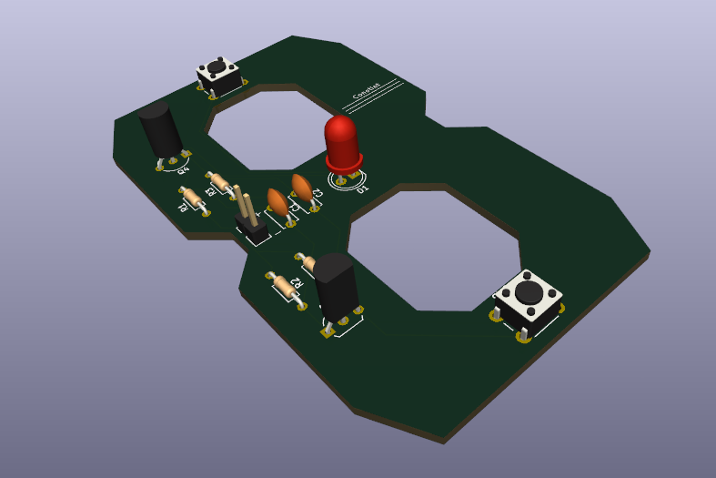
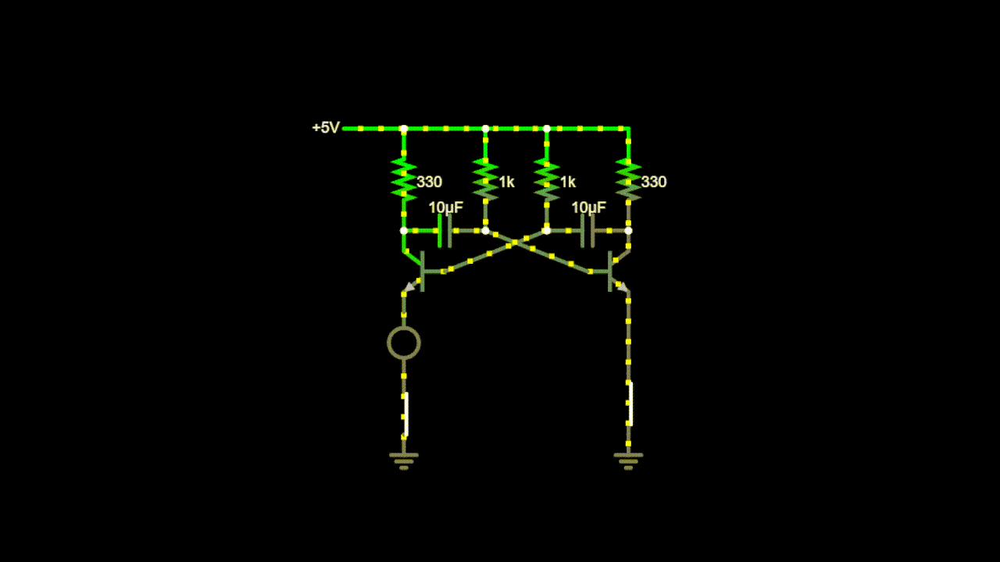
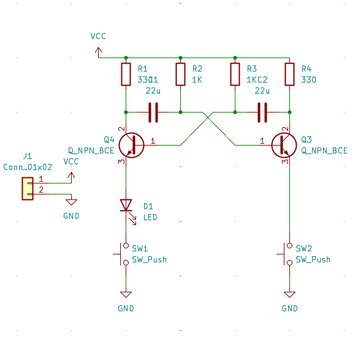
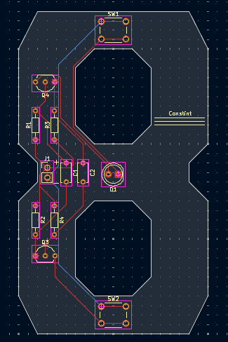

# Eight PCB

This is an astable multivibrator that I made for Week 2 of [Hack Club](https://hackclub.com/)'s [Resolution Program](https://resolution.hackclub.com/)'s Hardware Pathway.

## Simulation

This is an astable multivibrator which uses 2 transistors that take turns turning each other off with capacitors creating a delay. This creates oscilation which makes an LED blink. When the left switch is down, the LED will turn off, and when the right switch is down, the LED will blink. If the right switch is up, the LED will not blink, but will stay on.

[Link to Demo](https://is.gd/ewByXw)

## Schematic

## PCB

